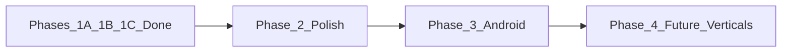

# SRS Gap Analysis & Roadmap

**Project:** SM Enterprises — yourmahabaleshwar.com  
**SRS version:** 1.0 (06 August 2026)  
**Codebase baseline:** Phase 1A + 1B + 1C (React PWA + Express/MongoDB)  
**Date:** 06 August 2026

---

## 1. Executive summary

The platform has a **credible web marketplace** for Mahabaleshwar tourism: customer/vendor/admin surfaces, multi-vertical bookings, OTP auth, Razorpay (with mock), GST invoices, commissions, subscriptions/points, ads, campaigns, backups, and a broad domain API layer.

**Largest remaining gaps vs full SRS:**

1. Native **Android** apps (customer + vendor) — today PWA only  
2. **Deep Marathi** localization (scaffold only)  
3. **Vendor self-registration UI** + wired KYC document upload  
4. Admin **placeholders** (office staff, guide packages UI, hourly UI, enquiries UI)  
5. **Future modules** (strawberry, Mapro, combo) — explicitly out of scope historically  

---

## 2. Scorecard (SRS sections)

| # | Section | Status | Notes |
|---|---------|--------|-------|
| 1 | Platforms | Partial | Website + Admin Done; Android customer/vendor Missing |
| 2 | Languages EN/MR | Partial | Toggle + ~70 keys; most screens still English |
| 3 | Roles | Partial | All core roles exist; office/marketing UIs thin; resort/taxi map to hotel/driver roles |
| 4 | Entity modules + docs | Partial | Listings + bookings Done; KYC upload UI unwired; admin for some verticals thin |
| 5 | Registration | Partial | Customer Done; vendor API Done, UI Missing |
| 6 | Auth OTP | Done | Customer/vendor OTP; admin password-only |
| 7 | Booking flow | Done | Search → book → pay → confirm → invoice → cancel/refund |
| 8 | Communication | Partial | SMS/Email/WhatsApp services; mock without keys |
| 9 | Payments + refunds | Done | Razorpay + policy-based refunds |
| 10 | GST invoices | Done | PDF download |
| 11 | Commission | Done | Booking-wise + admin rates API |
| 12 | Subscription + points | Done | Both models; accept-booking gate |
| 13 | Advertisements | Done | Packages, featured, analytics |
| 14 | Marketing campaigns | Done | Bulk Email/SMS/WhatsApp |
| 15 | Refund & cancellation | Done | Full/partial/none + tracking |
| 16 | Reports | Partial | Hub aggregates; not full export suite |
| 17 | Backup | Done | Manual + scheduled + restore |
| 18 | Admin dashboard | Partial | Most modules live; several PlaceholderPages |
| 19 | NFRs | Partial | Security basics + audit; monitoring/scale incomplete |
| 20 | Future scope | Missing | Strawberry / Mapro / Combo |

---

## 3. Platform matrix

| Surface | Status | Evidence |
|---------|--------|----------|
| Customer website | Done | `frontend/src` public routes + PWA |
| Customer Android | Missing | No Flutter/RN; installable PWA only |
| Vendor Android | Missing | Web `/dashboard/vendor` only |
| Admin web | Done | `frontend/src/admin` → `/admin/*` |

---

## 4. What Phase 1A–1C closed

| Phase | Focus | Outcome |
|-------|--------|---------|
| **1A** | Core product | OTP, Homestay + Horse, availability, Razorpay/refunds, reviews/wishlist, invoices, EN/MR scaffold, notifications |
| **1B** | Admin business | Subscriptions + points, wallet/payouts, ads, campaigns, reports hub, backups |
| **1C** | Domain backend | Vendor register/admin create, doc requirements, listing CRUD APIs, audit, destinations, templates, Domain Tools UI |

---

## 5. Gap backlog (prioritized)

### P0 — Product completeness (next delivery)

| ID | Gap | Effort | Recommendation |
|----|-----|--------|----------------|
| P0-1 | Vendor self-registration UI + KYC file upload to API | M | New `/register-vendor` wizard; wire multer to KYC fields |
| P0-2 | Complete EN/MR for public + booking + vendor dashboards | L | Expand locale files; bilingual CMS editors |
| P0-3 | Replace admin PlaceholderPages (Guide Packages, Hourly, Enquiries, Office Staff) | M | Wire existing 1C APIs to real pages |
| P0-4 | Homestay/Horse in main Property Admin nav (not only Domain Tools) | S | Reuse enterprise list patterns |
| P0-5 | Production payment/comms keys + webhook hardening | M | Razorpay webhook, SMS/WhatsApp templates live |

### P1 — Platform & ops

| ID | Gap | Effort | Recommendation |
|----|-----|--------|----------------|
| P1-1 | Native Android (customer) | XL | Flutter/RN against existing REST API; reuse JWT + OTP |
| P1-2 | Native Android (vendor) | L | Same stack; booking accept + wallet + KYC |
| P1-3 | Report exports (Excel/PDF) for all SRS report types | M | Build on `/admin/reports/hub` |
| P1-4 | Office staff permission matrix UI | M | Staff CRUD + scoped nav |
| P1-5 | Observability (logging/APM) + rate-limit tuning | M | Structured logs, health checks, Sentry |

### P2 — Future / optional

| ID | Gap | Effort | Recommendation |
|----|-----|--------|----------------|
| P2-1 | Strawberry selling module | L | New catalog + cart vertical |
| P2-2 | Mapro products module | L | Similar to P2-1 |
| P2-3 | Combo offers module | M | Bundle stays + experiences |

---

## 6. Recommended roadmap

### Phase 2 — Polish & go-live readiness (2–4 weeks)

1. Vendor registration wizard + KYC upload  
2. Finish admin placeholders → real pages on existing APIs  
3. Expand Marathi coverage (public + booking + vendor)  
4. Live Razorpay + SMS/WhatsApp configuration + webhooks  
5. Report Excel export  
6. UAT / seed demos / load smoke tests  

**Exit criteria:** End-to-end demo without Domain Tools for core vendor onboarding; payments and OTP work with real providers.

### Phase 3 — Android apps (4–8 weeks)

1. API contract freeze + OpenAPI snapshot → `docs/openapi-mobile-v1.yaml`  
2. Customer app: browse, book, pay, OTP, bookings, invoices → `mobile/` (Expo)  
3. Vendor app: bookings accept/reject, wallet, points, KYC → same app, vendor tabs  
4. Push notifications (FCM) alongside in-app → `POST /users/devices` + Expo push / Firebase Admin  

**Status (started):** Expo scaffold + core flows implemented. Remaining for Play Store: EAS build, live Razorpay native SDK, production Firebase `google-services.json`, UAT on devices.

**Exit criteria:** Play Store–ready builds against production API.

### Phase 4 — Future modules (as business prioritizes)

1. Combo offers → `/combos`, `ComboOffer` model, `POST /bookings/combo`  
2. Strawberry / Mapro e-commerce → `/strawberries`, `/mapro`, `Product` model, `POST /bookings/product`  
3. Admin hub → `/admin/shop` + `POST /admin/phase4/seed-defaults`  
4. Role → `PRODUCT_VENDOR` (`products@demo.com` after seed)

**Status:** Implemented (web + API + mobile catalog entries).

---

## 7. Demo credentials (after seed)

| Role | Email | Password |
|------|-------|----------|
| Super Admin | admin@yourmahabaleshwar.com | Admin@123 |
| Customer | customer1@demo.com | Customer@123 |
| Hotel vendor | hotel.vendor@demo.com | Vendor@123 |
| Homestay | homestay@demo.com | Vendor@123 |
| Horse | horse@demo.com | Vendor@123 |
| Products | products@demo.com | Vendor@123 |

Admin: password-only. Customer/vendor: password then OTP (dev OTP returned when not in production).

---

## 8. Decision log (locked earlier)

| Decision | Choice |
|----------|--------|
| Mobile for 1A–1C | React PWA; native Android later |
| Vendor monetization | Both monthly subscription **and** points |
| 1C approach | Full domain APIs first, minimal UI (Domain Tools) |

---

## 9. Suggested next action

Start **Phase 2 — Polish** with P0-1 (vendor register + KYC upload) and P0-3 (clear admin placeholders), unless Android (Phase 3) is the business priority.
